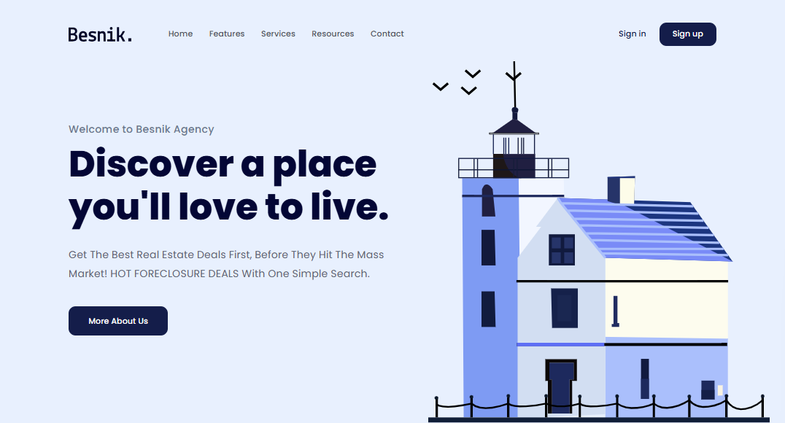
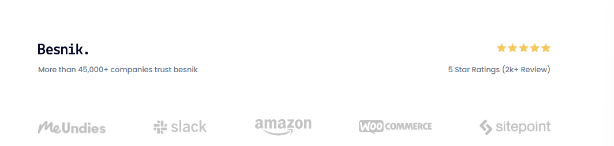
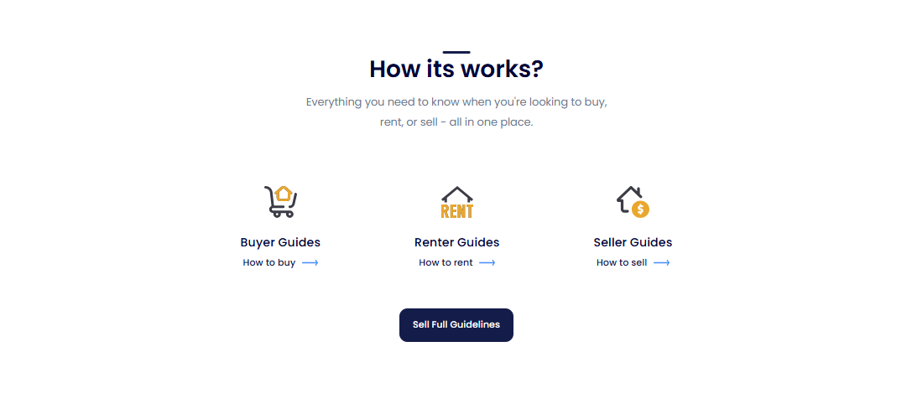
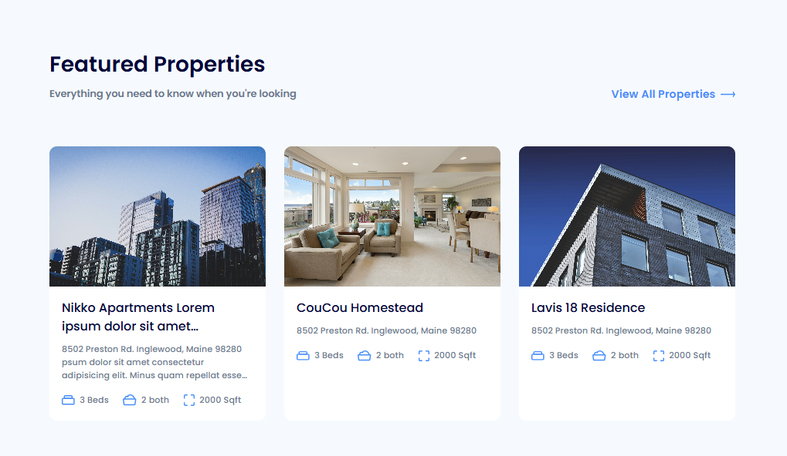
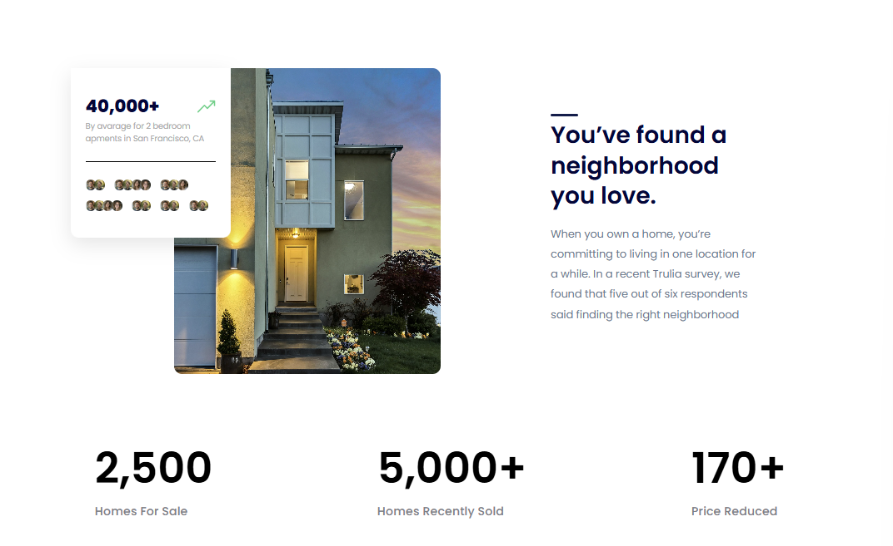
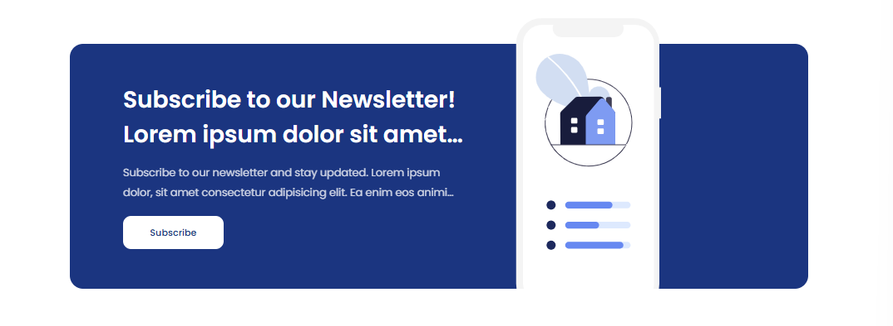
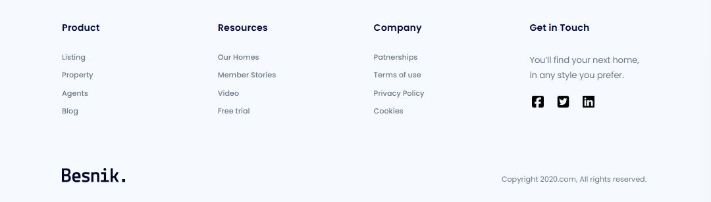

# 🏠 Real Estate Landing Page

A modern and responsive **Real Estate Landing Page** built with **HTML5** and **CSS3**.  
This project is designed to practice front-end layout skills, semantic HTML structure, reusable CSS styling, and responsive UI development.

---

## 📌 Features

- Clean and modern landing page design
- Navigation bar with call-to-action buttons
- Hero section with main introduction
- Trusted clients / partners section
- Guides section (Buy / Rent / Sell)
- Featured property cards
- Statistics / social proof section
- Newsletter subscription banner
- Footer with useful links and social media icons

---

## 🛠️ Technologies Used

- **HTML5**
- **CSS3**
- **Flexbox**
- **Custom Fonts**
- **Responsive Layout Basics**

---

## 📂 Project Structure

```bash
Proj_01.Real-Estate-Landing-Page/
│
├── index.html
├── README.md
│
└── assets/
    ├── css/
    │   ├── reset.css
    │   └── styles.css
    │
    ├── fonts/
    │   └── stylesheet.css
    │
    └── img/
        ├── logo.svg
        ├── hero-img.svg
        ├── featured-1.jpg
        ├── featured-2.jpg
        ├── featured-3.jpg
        ├── stats-img.jpg
        ├── newletter.svg
        └── ...
```

---

## 🚀 How to Run

### Option 1: Open directly

Just open the `index.html` file in your browser.

### Option 2: Use VS Code Live Server

1. Open the project in **VS Code**
2. Install the **Live Server** extension
3. Right-click `index.html`
4. Choose **Open with Live Server**

---

## 🎯 Learning Objectives

This project helps practice:

- Semantic HTML structure
- CSS class naming and organization
- Layout building with **Flexbox**
- Image sizing and alignment
- Card UI design
- Spacing, typography, and button styling
- Reusable CSS components
- Basic UI/UX design thinking

---

## ⚠️ Notes / Improvements

Some improvements can still be made:

- Add full responsive design for tablet and mobile
- Improve accessibility (**a11y**) with better alt text and labels
- Optimize image sizes for performance
- Fix minor naming/typo issues such as:
  - `subcription` → `subscription`
  - `both` → `bath`
  - `Patnerships` → `Partnerships`
  - `How its works?` → `How it works?`
- Add hover effects and transitions
- Convert repeated sections into reusable components (if rebuilt with React later)

---

## 📸 Preview

You can add screenshots here later.

## 📸 Preview

You can add screenshots here later.

### Header



### Clients



### Guides



### Featured



### Stats



### Subscription



### Footer

## 

## 🚀 Git Commit Convention

Use clear and meaningful commit messages:

- `feat`: add login functionality
- `fix`: resolve navbar overflow issue
- `refactor`: optimize API response handling
- `style`: fix button alignment
- `docs`: update README setup guide

### Example:

```bash
git commit -m "feat: build featured properties section"
git commit -m "fix: remove horizontal scrollbar in hero section"
git commit -m "docs: add project README"
```

---

## 👨‍💻 Author

**Roy Hung**

- GitHub: [_(GitHub profile here)_](https://github.com/roymhung/Proj_01.Real-Estate-Landing-Page)
- Portfolio: _(add later if needed)_

---

## 📄 License

This project is created for **learning and practice purposes**.
